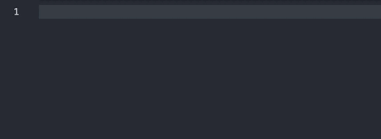

# 🟢 Hello World! I'm Noirspider 🟢

Hey there! I'm a tech enthusiast with a passion for diving into all sorts of cool technologies. Whether it's tinkering with new frameworks or exploring fresh coding languages, I'm always up for a challenge. Outside of coding, you can catch me swapping memes with the team and working together like a well-oiled machine. Big believer in the power of teamwork and sharing knowledge. Ready to jump into the coding fun?

✨Skill:

- 🌐 Web Development: 
  
  
  
  
- 🔄 State Management: 
- 🖥️ Frontend Frameworks: 
- 🟢 Backend: 
  
- 🗄️ Databases: 
- � Programming: 
- 🛠️ Tools: 
  
  
  
- Operative System:
  
  
  
  

  I'm currently focusing on

  - 🐳 Docker: 
  - 🐍 Python: 

🤝 Connect with Me:

📊 **My GitHub Statistics:**

🏆 **Achievements**

<!--
-->

V I S I T O R - C O U N T :

